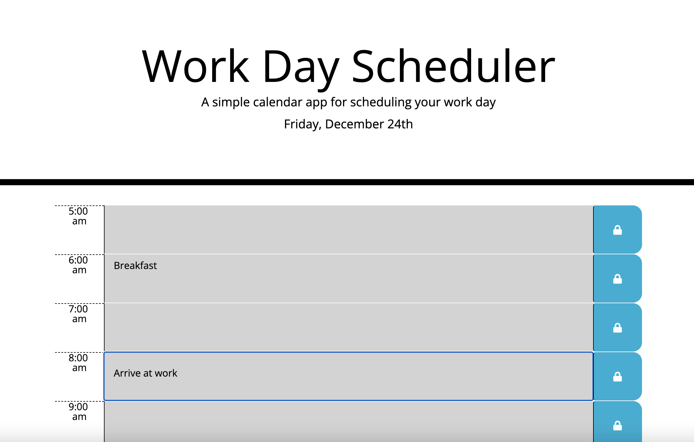
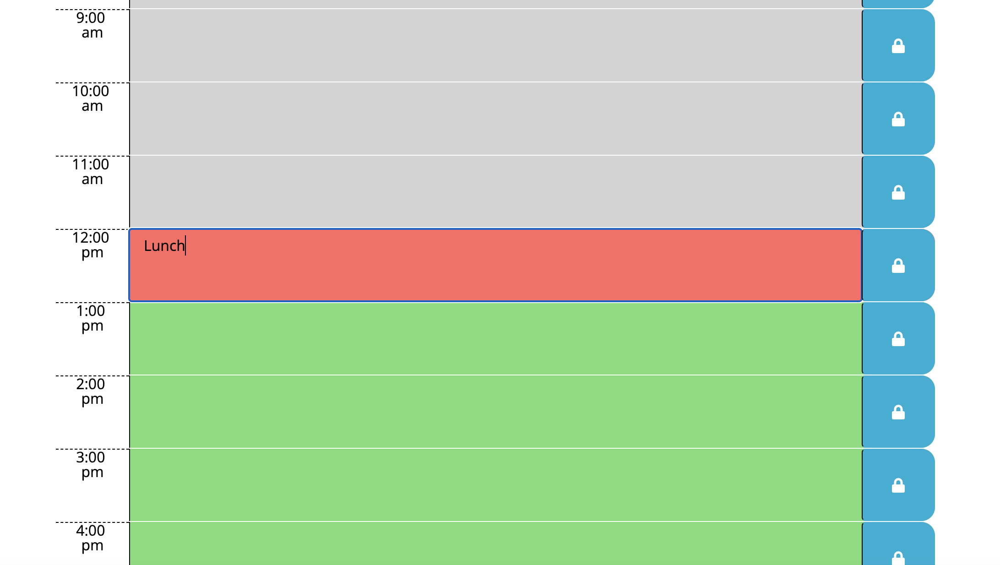
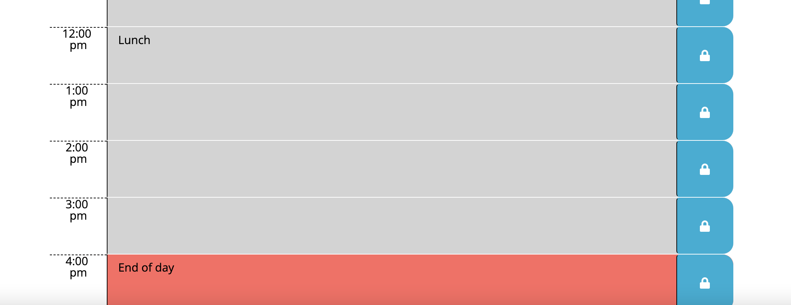

# WorkDayScheduler# WorkDayScheduler

A daily schedule planner using the Moment.js Library 

## Description

- User sees the current date on top of the page
- The User clicks on a row representing an hour of the day to list tasks they need to accomplish during that hour
- The page updates dynamically so that the current hour's background is red, the past hours have a grey backgorund, and the future hours have a green background
- When clicking the lock icon, the tasks are stored in local storage so the user can access them even if leaving the page

## Screenshots

## Links

-Link to [GitHub Repo](https://github.com/Zacharycampanelli/WorkDayScheduler)

-Link to [Deployed Webpage](https://zacharycampanelli.github.io/WorkDayScheduler/)

## Authors

Zachary Campanelli

[@zackcampanelli](https://www.linkedin.com/in/zackcampanelli/)
